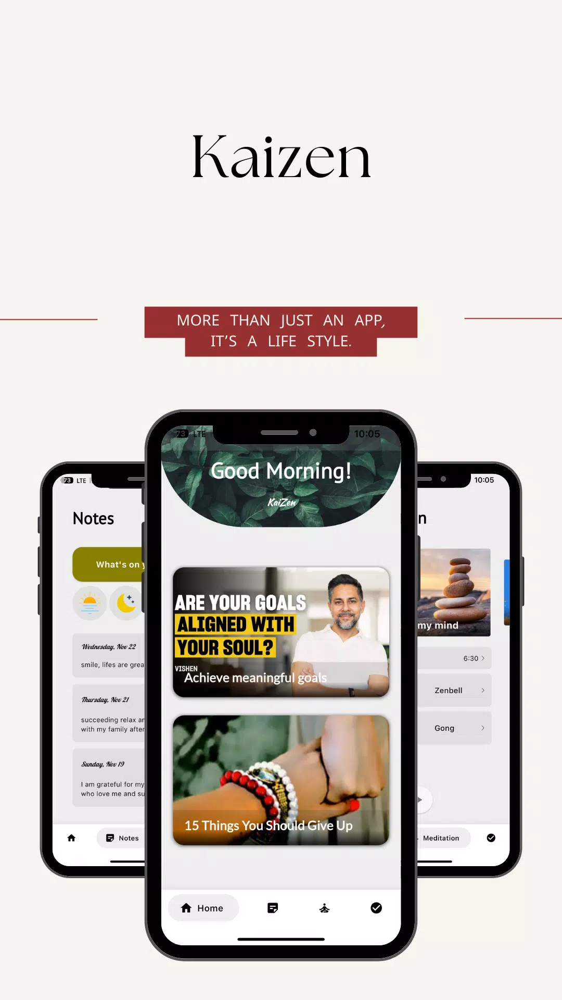
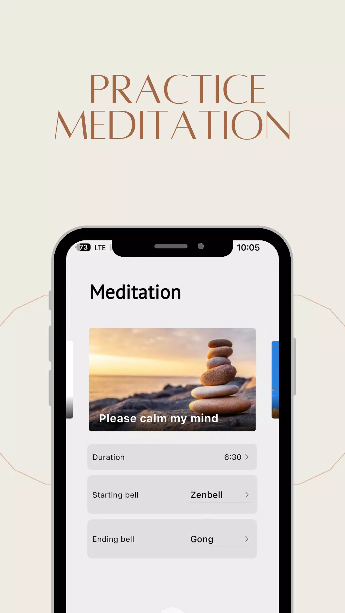
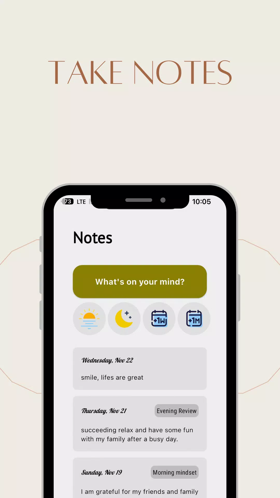
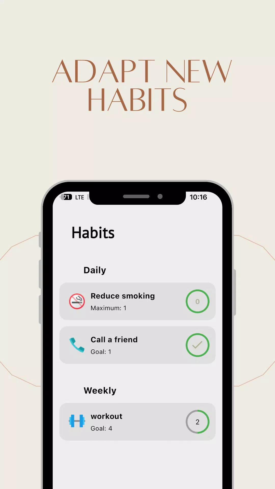
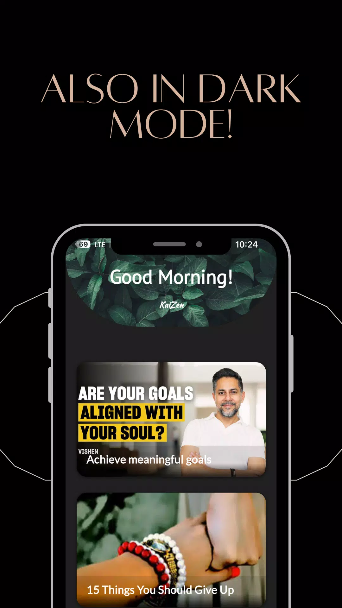

# Kaizen 🧘‍♂️

**Kaizen** is a personal development mobile application built on the philosophy of continuous improvement. It empowers users to make small, consistent changes in their lives to achieve significant long-term results.

## 📱 Features

* **Habit Tracking:** Track and adapt your habits to create positive and lasting routines.
* **Mindfulness & Meditation:** Practice meditation to reduce stress and increase overall happiness.
* **Thought Organization:** Take notes and organize your ideas in one centralized location.
* **Curated Content:** Read motivating articles to learn from experts and peers.

## 📸 Screenshots

  
  
  
  
  

