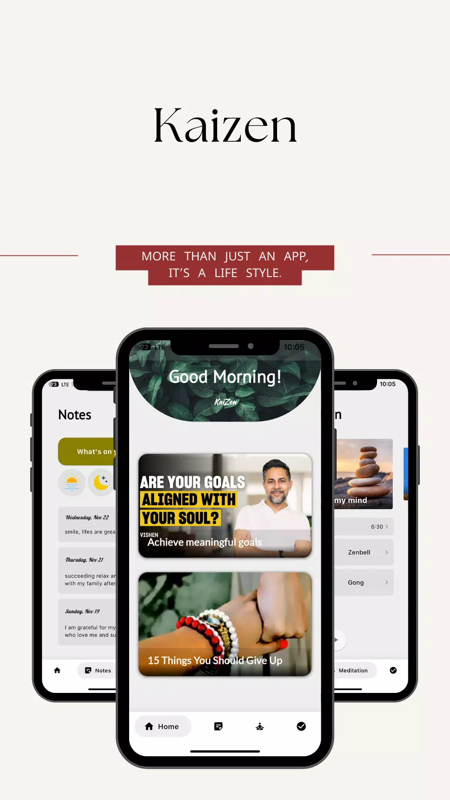
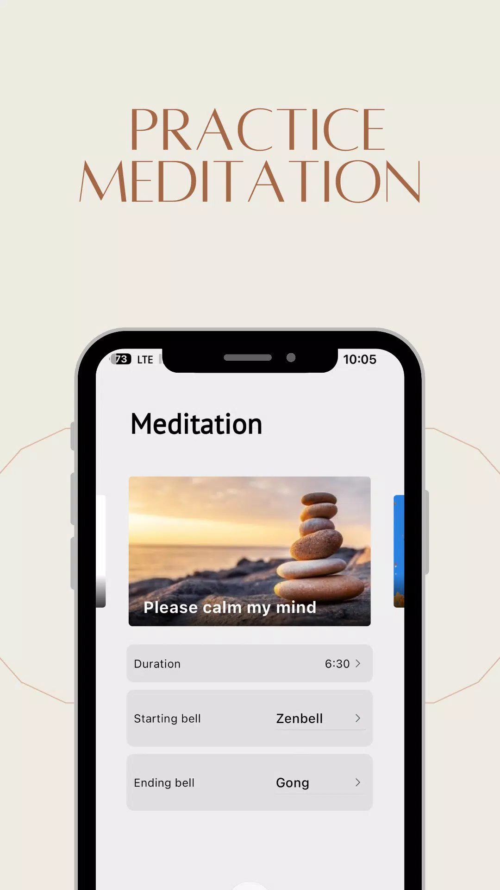
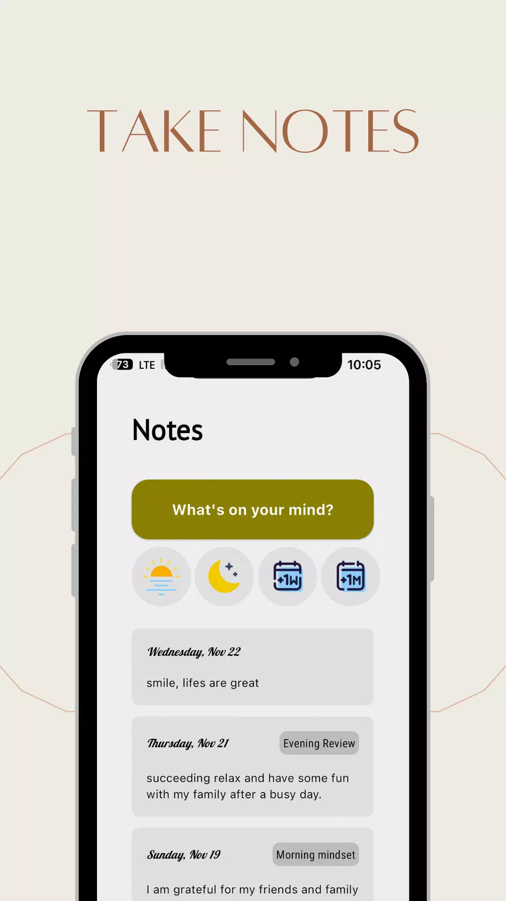
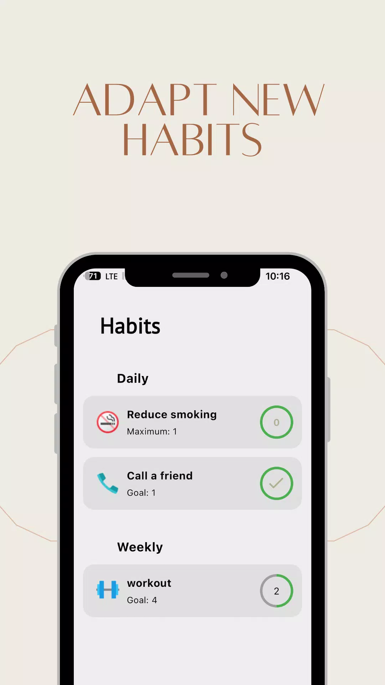
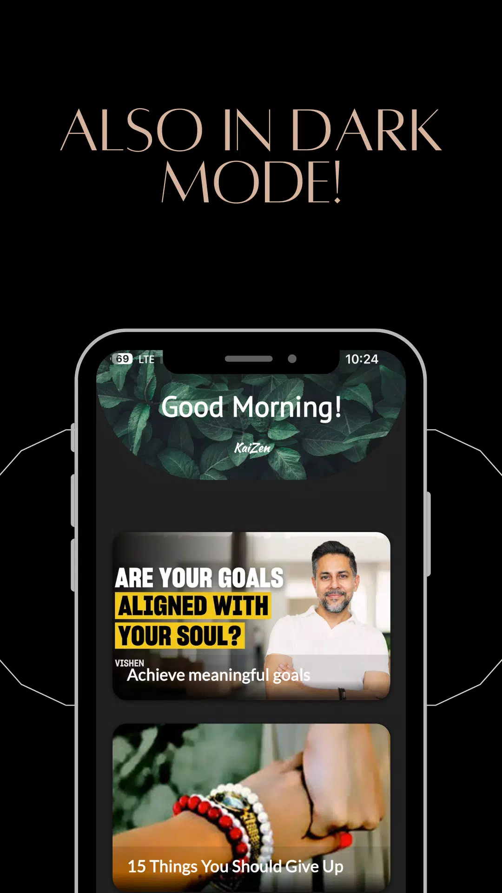

# Kaizen 🧘‍♂️

**Kaizen** is a personal development mobile application built on the philosophy of continuous improvement. It empowers users to make small, consistent changes in their lives to achieve significant long-term results.

## 📱 Features

* **Habit Tracking:** Track and adapt your habits to create positive and lasting routines.
* **Mindfulness & Meditation:** Practice meditation to reduce stress and increase overall happiness.
* **Thought Organization:** Take notes and organize your ideas in one centralized location.
* **Curated Content:** Read motivating articles to learn from experts and peers.

## 📸 Screenshots

  
  
  
  
  

---

## 🏆 Impact & Milestone

During its active time in the store, **Kaizen successfully reached over 1,000+ organic downloads**, as captured by [APKPure](https://apkpure.net/kaizen/com.flixdeveloper.kaizen). 

Although the app is no longer actively distributed, this milestone stands as a testament to the real-world value and validation the product provided to its users.

  

